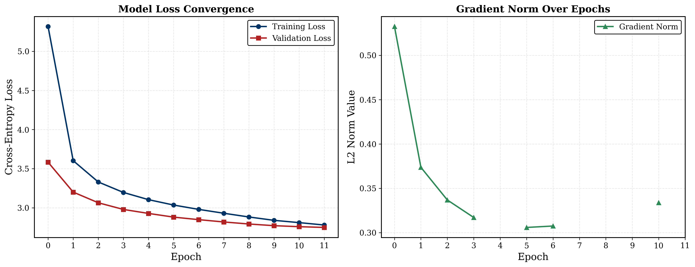

<div align="center">

# 🔥 Transformer from Scratch

### A production-grade, pure-PyTorch implementation of the Transformer architecture — no `nn.Transformer`, no shortcuts.

**English → French machine translation** trained on **1.1M sentence pairs** with modern techniques from LLaMA, PaLM, and GPT.

[](https://python.org)
[](https://pytorch.org)
[](LICENSE)
[](https://github.com/SahilSharma1306/transformer-from-scratch/actions)

</div>

---

## Why This Project Exists

Most "Transformer from scratch" tutorials stop at `nn.Linear` and call it a day. This one doesn't.

I built **every primitive by hand** — `Linear`, `Embedding`, `RMSNorm`, `Softmax`, `Rotary Embeddings` — then assembled them into a full encoder-decoder Transformer that **actually translates between languages**. The goal was to prove I understand not just *what* each component does, but *why* it's shaped the way it is, and how to engineer a training pipeline that scales.

---

## ⚡ Key Highlights

| Area | What I Built |
|---|---|
| **Architecture** | Full encoder-decoder Transformer (6+6 layers, 8 heads, d=512, **~148M params**) |
| **From scratch** | Custom `Linear`, `Embedding`, `RMSNorm`, `Softmax`, `RotaryPositionalEmbedding`, `SwiGLU FFN` |
| **Modern design** | RoPE instead of sinusoidal PE, RMSNorm instead of LayerNorm, SwiGLU instead of ReLU FFN |
| **Weight tying** | Projection layer shares weights with target embeddings (saves ~10M params) |
| **Training infra** | Multi-GPU DDP, mixed precision (FP16 + GradScaler), gradient accumulation (effective batch = 256) |
| **LR schedule** | Cosine annealing with linear warmup (5% warmup → cosine decay to 10× lower) |
| **Data pipeline** | 1.1M pairs from OPUS Books + OPUS-100, pre-tokenized to NumPy, zero-copy `__getitem__` |
| **Tokenization** | BPE tokenizers (20K vocab) trained from scratch using HuggingFace `tokenizers` (Rust backend) |
| **Regularization** | Label smoothing (0.1), dropout (0.3), weight decay (0.1), gradient clipping (max norm 1.0) |
| **Early stopping** | Patience-based with DDP-safe broadcast to synchronize all ranks |

---

## 🏗️ Architecture Decisions & Rationale

### Why RoPE over Sinusoidal Positional Encoding?
Sinusoidal embeddings are **additive** — they inject position into the residual stream and get gradually washed out by deeper layers. RoPE (Rotary Position Embedding) applies position as a **rotation** directly to Q and K in attention, which means:
- Position information is preserved through all layers
- The model naturally learns relative position (the dot product between rotated Q and K depends only on their relative distance)
- It generalizes better to unseen sequence lengths

### Why RMSNorm over LayerNorm?
LayerNorm computes both mean and variance, then re-centers and re-scales. RMSNorm **drops the mean computation** entirely — it only normalizes by the root mean square. This is ~15% faster with no loss in quality (as shown in the LLaMA paper). I also use **Pre-Norm** (normalize before attention/FFN) rather than Post-Norm, which gives more stable gradients.

### Why SwiGLU over ReLU FFN?
The standard Transformer FFN is `Linear → ReLU → Linear`. SwiGLU replaces this with a gated mechanism: `(Linear₁(x) · σ(Linear₁(x))) ⊙ Linear₃(x)`, where σ is the sigmoid function (making the gate a Swish/SiLU activation). This adds a third weight matrix but produces better representations per FLOP. The hidden dimension is set to `⌈(8/3)d⌉` rounded to the nearest 64 for GPU memory alignment.

### Why Weight Tying?
The target embedding matrix and the final projection layer perform inverse operations (embed → hidden, hidden → logits). Sharing their weights acts as a strong regularizer, saves ~10M parameters, and has been shown to improve generalization (Press & Wolf, 2017).

---

## 📊 Training Results

Trained for **12 epochs** on 2× NVIDIA T4 GPUs (Kaggle) — ~90 minutes per epoch.

<div align="center">



</div>

| Metric | Value |
|---|---|
| Final Training Loss | **2.76** |
| Final Validation Loss | **2.73** |
| Best Validation Loss | **2.73** (epoch 11) |
| Training Data | 1,117,085 sentence pairs (OPUS Books + OPUS-100) |
| Gradient Norm (final) | ~0.33 (stable, no explosions) |

### Translation Examples (from validation set)

```
SOURCE:    I'm the director and I'm asking you to cry.
TARGET:    Je suis la réalisatrice et je vous demande de pleurer.
PREDICTED: Je suis le directeur et je vous demande de pleurer.
```

```
SOURCE:    Wait
TARGET:    Attends
PREDICTED: Attends.
```

The model captures correct grammar, vocabulary, and sentence structure. Minor differences (e.g., *directeur* vs *réalisatrice*) reflect ambiguity in the source — both are valid translations.

---

## 📁 Project Structure

```
transformer-from-scratch/
├── model.py           # Full Transformer: Linear, Embedding, RMSNorm, RoPE,
│                      #   SwiGLU FFN, Multi-Head Attention, Encoder, Decoder
├── dataset.py         # BPE tokenizer training, NumPy caching, BilingualDataset
├── train.py           # DDP training loop with AMP, cosine LR, early stopping
├── validation.py      # Greedy decoding + teacher-forced validation loss
├── inference.py       # Standalone EN→FR translation CLI
├── config.py          # All hyperparameters in one place
├── requirements.txt   # pip dependencies
├── LICENSE            # MIT
├── .github/workflows/ # CI: linting + import checks
└── assets/
    └── training_curves.png
```

---

## 🚀 Quick Start

### 1. Install dependencies

```bash
pip install -r requirements.txt
```

### 2. Train (single GPU)

```bash
torchrun --nproc_per_node=1 train.py
```

### 3. Train (multi-GPU)

```bash
torchrun --nproc_per_node=2 train.py
```

The first run will automatically:
1. Download OPUS Books + OPUS-100 (en-fr) from HuggingFace
2. Train BPE tokenizers (20K vocab each) and save to disk
3. Pre-tokenize the entire dataset to NumPy (one-time, cached)
4. Begin training with checkpoints saved every epoch

### 4. Resume from checkpoint

Edit `config.py` and set `"preload": "05"` (or any epoch number) to resume training.

### 5. Translate (inference)

```bash
python inference.py --text "The weather is beautiful today."
```

```
  EN: The weather is beautiful today.
  FR: Le temps est beau aujourd'hui.
```

Run `python inference.py --help` for all options (custom checkpoint path, device selection).

---

## 🔧 Engineering Details

### Training Pipeline Optimizations

| Optimization | Impact |
|---|---|
| **Pre-tokenized NumPy cache** | `__getitem__` does zero string ops — pure tensor construction |
| **DDP `no_sync()` on micro-batches** | AllReduce only on accumulation boundaries (4× fewer comms) |
| **Fused AdamW** | Single CUDA kernel for all parameter updates |
| **`pin_memory` + `non_blocking`** | Overlaps CPU→GPU transfers with compute |
| **`persistent_workers`** | Avoids DataLoader worker respawning between epochs |
| **`set_to_none=True`** | Saves memory vs zeroing gradients |
| **Cached causal masks** | Greedy decode reuses masks instead of reallocating |
| **Pre-allocated decode buffer** | O(n) vs O(n²) from `torch.cat()` per step |

### Custom Initialization

All weights use **truncated normal** initialization with Glorot-aware standard deviation:
```python
std = (2 / (fan_in + fan_out)) ** 0.5
nn.init.trunc_normal_(W, 0.0, std, -3*std, 3*std)
```
This prevents dead neurons and gradient vanishing at init — critical for deep networks without batch normalization.

---

## 🧠 What I Learned

1. **The attention mask is everything.** Getting the encoder padding mask, decoder causal mask, and cross-attention mask right is where most bugs hide. One off-by-one error and the model "cheats" by attending to future tokens.

2. **Gradient accumulation + DDP requires careful sync.** Naively calling `backward()` on every micro-batch triggers an AllReduce per step. Wrapping non-final steps in `model.no_sync()` cuts communication by 4×.

3. **Label smoothing is underrated.** Setting it to 0.1 prevents the model from becoming overconfident on training data and significantly improves validation loss convergence.

4. **Pre-tokenizing to disk changes everything.** Moving tokenization out of the DataLoader hot path turned a CPU-bound pipeline into a GPU-bound one.
---

## 🔮 Limitations & Future Work

- **Data scale vs model capacity.** At 148M parameters, this model has significantly more capacity than 1.1M sentence pairs can fully exploit. Scaling to WMT-scale data (40M+ pairs) would unlock substantially better translation quality — the architecture is ready, the data is the bottleneck.
- **Greedy decoding only.** The current inference uses argmax at each step. Adding beam search (beam width 4–5) with length normalization would improve translation fluency at the cost of ~4× decode time.
- **No BLEU evaluation.** Validation loss is tracked, but a proper BLEU/chrF++ benchmark against WMT baselines would give a clearer picture of translation quality.


---

## 📚 References

- Vaswani et al., [*Attention Is All You Need*](https://arxiv.org/abs/1706.03762) (2017) — Original Transformer
- Su et al., [*RoFormer: Enhanced Transformer with Rotary Position Embedding*](https://arxiv.org/abs/2104.09864) (2021) — RoPE
- Zhang & Sennrich, [*Root Mean Square Layer Normalization*](https://arxiv.org/abs/1910.07467) (2019) — RMSNorm
- Shazeer, [*GLU Variants Improve Transformer*](https://arxiv.org/abs/2002.05202) (2020) — SwiGLU
- Press & Wolf, [*Using the Output Embedding to Improve Language Models*](https://arxiv.org/abs/1608.05859) (2017) — Weight Tying

---

## 📄 License

MIT — see [LICENSE](LICENSE).
